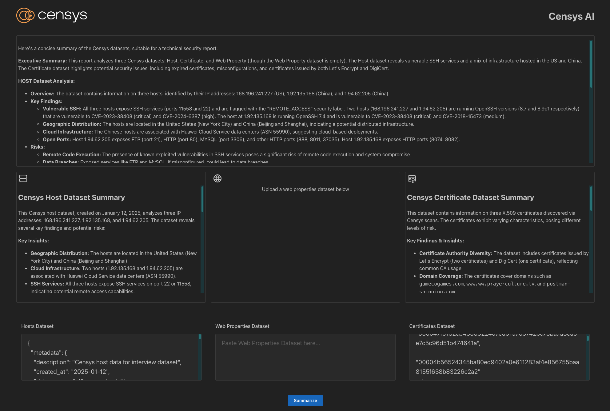

# Censys AI

AI-powered assistant for analyzing and summarizing Censys cybersecurity datasets with a clean, modern interface.



## Features

* 🚀 **Modern Tech Stack**
  * FastAPI backend with Python 3.10+
  * React + TypeScript + Mantine UI frontend
  * End-to-end type safety with OpenAPI

* 🔍 **Powerful Analysis**
  * Simultaneously analyze multiple Censys datasets
  * Individual and combined dataset summarization
  * Interactive results with Markdown rendering

* 🛠 **Developer Friendly**
  * Modular summarization pipeline with LiteLLM
  * Modern dependency management with [uv](https://docs.astral.sh/uv/)
  * Comprehensive error handling and loading states
  * Responsive design for all screen sizes

## Requirements
* Python 3.10+
* Node.js 22+
* [uv](https://docs.astral.sh/uv/) (install via `curl -LsSf https://astral.sh/uv/install.sh | sh`)
* [Yarn](https://yarnpkg.com/) (install via `npm install --global yarn`)

## 🚀 Quick Start

### Backend Setup

```bash
# Navigate to backend directory
cd backend

# Create and activate virtual environment
uv venv
source .venv/bin/activate

# Install dependencies
uv sync --all-extra

# Start the development server
python main.py

# Copy .env.example to .env and fill in your OpenAI API key
cp src/censys_ai/.env.example src/censys_ai/.env
```

**Keep an eye on the terminal for any errors, i.e lack of OpenAI API key.**

### Frontend Setup

```bash
# Navigate to frontend directory
cd frontend

# Install dependencies
yarn install

# Start the development server
yarn dev
```

See terminal for the frontend URL, it will likely be `http://localhost:5173`

**You are now ready to summarize some Censys data!**

## Usage

* After starting the backend and frontend servers, you can access the application at `http://localhost:5173`
* You will notice text fields on the bottom of the screen, and a button that says `Summarize`
* Simply copy and paste the contents of dataset files into their appropriate text fields, and click `Summarize`
* See [example datasets](example_datasets/) for some example datasets to use
* The results will be displayed in their respective sections above
* You do not need to populate all dataset fields, but at least one is required

## Model Configuration

* If you do not wish to use the default model, you can update the `MODEL` environment variable in [backend/src/censys_ai/.env](backend/src/censys_ai/.env.example) **(Make sure to copy the example to a `.env` file)**
* LiteLLM is used under the hood, so any model supported by LiteLLM is supported by this application
* See [LiteLLM](https://docs.litellm.ai/docs/) for more info on which models to use and how to configure them.


## Project Structure

```
censys-ai/
├── backend/                  # FastAPI backend
│   ├── src/
│   │   └── censys_ai/       # Python package
│   │       ├── api/         # API routes and models
│   │       ├── services/    # Business logic
│   │       └── models/      # Data models
│   ├── tests/               # Backend tests
│   └── pyproject.toml       # Project configuration
│
├── frontend/                # React frontend
│   ├── public/              # Static files
│   └── src/                 # Source code
│       ├── api/             # API client code
│       ├── components/      # Reusable components
│       └── App.tsx          # Main application component
│
├── example_datasets/        # Sample datasets for testing
└── README.md                # This file
```

## Development Workflow
* Made use of Claude to iterate on specs, see `specs/Censys AI Summarization Agent - Project Specifications.pdf`
* Made changes and stored them in [specs/censys_ai_specs.md](specs/censys_ai_specs.md)
* Split requirements into individual story specs in [specs/stories/](specs/stories/)
* Used Windsurf to assist in spec implementation
* Your mileage may vary, had to make some changes to the specs to get them to work
* also reduced scope of some specs to make them more achievable

## Future Enhancements
* Improve prompt engineering:
    * Use more specialized instructions per dataset, lean on Censys docs for more info
    * Provide stronger instructions for a more consistent output and structure
    * Introduce citations
    * Potentially use structured output to break summary into specific sections and request reasoning for each section
* Improve UI in terms of both user experience and code quality
    * Support streaming
    * Improve error reporting, especially for malformed or invalid datasets
    * File upload support
    * Conversational UI?
    * Actually break out reusable components
* If supporting a conversational experience, add support for saving conversation history
* Add support for saving results to a file
* Potentially use an actual thought loop to iterate on datasets and specific questions
* Potentially make datasets more RAGable for better context and more specific questions
* CI/CD for deployment
* Add E2E tests
* Add evaluation of the summarization results
* Improve test coverage
* Observability

## References
* [Censys Platform Datasets](https://docs.censys.com/docs/platform-datasets)
* [Censys Host Dataset](https://docs.censys.com/docs/platform-host-dataset)
* [Censys Web Property Dataset](https://docs.censys.com/docs/platform-web-property-dataset)
* [Censys Certificate Dataset](https://docs.censys.com/docs/platform-certificate-dataset)
* [uv Documentation](https://docs.astral.sh/uv/)
* [FastAPI](https://fastapi.tiangolo.com/)
* [Mantine UI](https://mantine.dev/)
* [LiteLLM](https://github.com/BerriAI/litellm)

---

For questions or contributions, please contact Dave Mariano.
